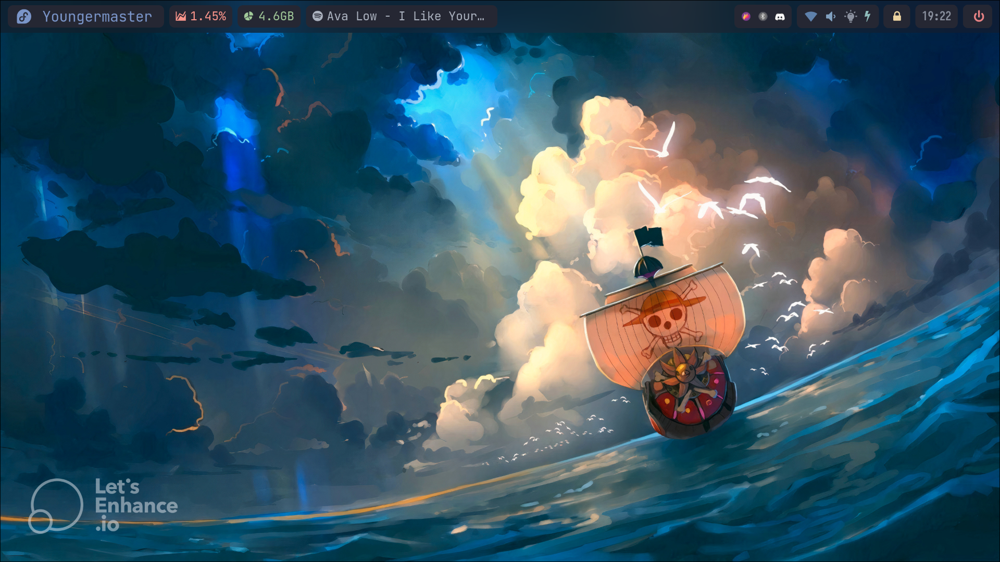
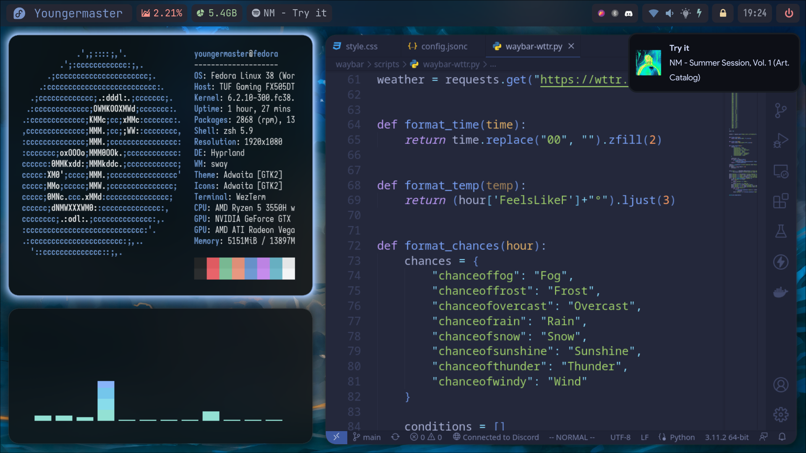

# Fedora Dotfiles

This is where I'll be placing my Fedora configuration files.

## Hypr All Blue

# TODO

- [ ] Add Ansible support to the project.
- [ ] Add the [xdg-desktop-portal-hyprland](https://archlinux.org/packages/community/x86_64/xdg-desktop-portal-hyprland/) support.
- [ ] Improve the waybar with [Hyprland's waybar](https://wiki.hyprland.org/hyprland-wiki/pages/Useful-Utilities/Status-Bars/#waybar).
    - [ ] Solve the `wlr/workspaces` not showing.
- [x] Add the picture to show off the results.
- [ ] Give a better format to the `startup_installation.sh` file.
- [ ] Create the autoinstall script.
